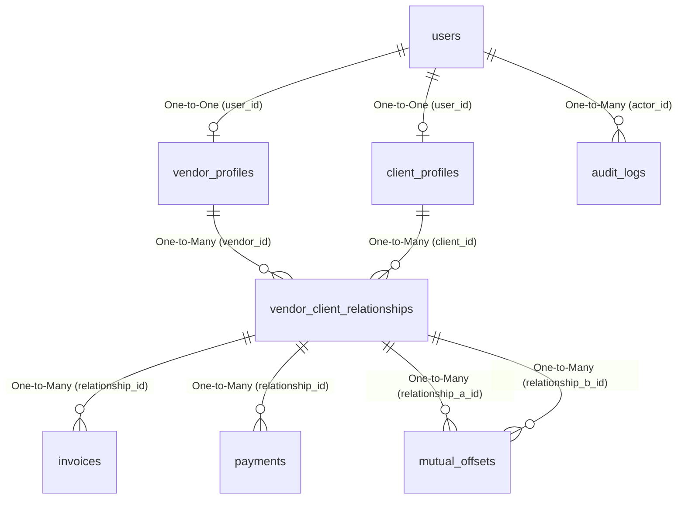

# Bilateral Ledger Database Schema & Relationship Specification

This document details the complete relational database schema, entity structures, constraints, and mappings for the Bilateral Ledger double-entry financial settlement network.

---

## 📊 Entity-Relationship Diagram (ERD)

---

## 📂 Entity Specifications & Tables

### 1. `users` Table
Stores system-wide user credentials and acts as the parent anchor for both client and vendor profiles.

| Column | Type | Constraints / Keys | Description |
| :--- | :--- | :--- | :--- |
| `id` | `UUID` | **PRIMARY KEY**, Auto-Generated | System-wide unique identifier for the user account. |
| `email` | `VARCHAR(255)` | **UNIQUE**, **NOT NULL** | Business email address used for login and notifications. |
| `password_hash` | `VARCHAR(255)` | **NOT NULL** | BCrypt hashed password credentials. |

---

### 2. `vendor_profiles` Table
Stores metadata for users operating in a **Seller / Vendor** role.

| Column | Type | Constraints / Keys | Description |
| :--- | :--- | :--- | :--- |
| `id` | `UUID` | **PRIMARY KEY**, Auto-Generated | Unique identifier for the vendor profile. |
| `user_id` | `UUID` | **FOREIGN KEY** → `users.id`, **One-to-One** | Link to the core user identity account. |
| `business_name` | `VARCHAR(255)` | Default Null | Registered legal trade name of the business. |

---

### 3. `client_profiles` Table
Stores metadata for users operating in a **Buyer / Client** role.

| Column | Type | Constraints / Keys | Description |
| :--- | :--- | :--- | :--- |
| `id` | `UUID` | **PRIMARY KEY**, Auto-Generated | Unique identifier for the client profile. |
| `user_id` | `UUID` | **FOREIGN KEY** → `users.id`, **One-to-One** | Link to the core user identity account. |
| `customer_name` | `VARCHAR(255)` | Default Null | Display name of the customer or business client. |
| `is_pending` | `BOOLEAN` | Default `false` | Status toggle for accounts undergoing registration vetting. |

---

### 4. `vendor_client_relationships` Table
Manages active dual-direction credit pipelines and current ledger balances between trade pairs.

| Column | Type | Constraints / Keys | Description |
| :--- | :--- | :--- | :--- |
| `id` | `UUID` | **PRIMARY KEY**, Auto-Generated | Unique relationship identifier. |
| `vendor_id` | `UUID` | **FOREIGN KEY** → `vendor_profiles.id` | Link to the selling party profile. |
| `client_id` | `UUID` | **FOREIGN KEY** → `client_profiles.id` | Link to the buying party profile. |
| `credit_limit` | `DECIMAL(19,2)` | Default `0.00` | Approved deferred trade credit pipeline cap. |
| `current_balance` | `DECIMAL(19,2)` | Default `0.00` | Net ledger balance of all transactions, invoices, and offsets. |

> [!NOTE]
> **Unique Constraint:** The combination of `(vendor_id, client_id)` is enforced as unique to prevent duplicate trading networks between the same pair of businesses.

---

### 5. `invoices` Table
Detailed registries of transactions and payable bills issued from vendors to clients.

| Column | Type | Constraints / Keys | Description |
| :--- | :--- | :--- | :--- |
| `id` | `UUID` | **PRIMARY KEY**, Auto-Generated | Unique invoice identifier. |
| `relationship_id` | `UUID` | **FOREIGN KEY** → `vendor_client_relationships.id` | Active credit relationship pipeline mapping. |
| `invoice_number` | `VARCHAR(255)` | **NOT NULL** | Custom transaction code tracking value. |
| `product_name` | `VARCHAR(255)` | **NOT NULL** | Name/description of the trade item or service. |
| `product_unit` | `VARCHAR(50)` | Default Null | Sizing metrics (e.g., hours, licenses, units, kg). |
| `quantity` | `INTEGER` | **NOT NULL** | Total amount of units purchased. |
| `rate_per_unit` | `DECIMAL(19,2)` | **NOT NULL** | Fixed trade cost per single unit. |
| `total_amount` | `DECIMAL(19,2)` | **NOT NULL** | Gross amount of the invoice (`quantity * rate_per_unit`). |
| `amount_due` | `DECIMAL(19,2)` | **NOT NULL** | Remaining unsettled invoice value. |
| `amount_paid` | `DECIMAL(19,2)` | Default `0.00` | Total cumulative cash/offset payments received. |
| `status` | `VARCHAR(50)` | Enum (String) | Lifecycle state: `DRAFT`, `SENT`, `PARTIAL`, `PAID`, `VOID`, `OVERDUE` |
| `due_date` | `TIMESTAMP` | **NOT NULL** | Deadline timestamp for invoice settlement maturity. |
| `created_at` | `TIMESTAMP` | Default `now()` | Generation timestamp of invoice submission. |

---

### 6. `payments` Table
Cash injections processed manually or via bank APIs to settle invoice structures.

| Column | Type | Constraints / Keys | Description |
| :--- | :--- | :--- | :--- |
| `id` | `UUID` | **PRIMARY KEY**, Auto-Generated | Unique payment ID. |
| `relationship_id` | `UUID` | **FOREIGN KEY** → `vendor_client_relationships.id` | Active relationship pipeline mapping. |
| `amount` | `DECIMAL(19,2)` | **NOT NULL** | Paid cash currency amount. |
| `reference_number`| `VARCHAR(255)` | Default Null | Bank transfer tracking receipt number. |
| `payment_date` | `TIMESTAMP` | Default `now()` | Recording time of the incoming payment. |

---

### 7. `mutual_offsets` Table
Records automatic offsets when a Vendor and Client have overlapping mutual accounts, wiping liabilities without cash.

| Column | Type | Constraints / Keys | Description |
| :--- | :--- | :--- | :--- |
| `id` | `UUID` | **PRIMARY KEY**, Auto-Generated | Unique offset reconciliation ID. |
| `relationship_a_id`| `UUID` | **FOREIGN KEY** → `vendor_client_relationships.id` | Trading pipeline of Side A. |
| `relationship_b_id`| `UUID` | **FOREIGN KEY** → `vendor_client_relationships.id` | Reverse trading pipeline of Side B. |
| `offset_amount` | `DECIMAL(19,2)` | **NOT NULL** | Total liabilities cleared completely without physical money. |
| `created_at` | `TIMESTAMP` | Default `now()` | Reconciliation timestamp of automatic settlement. |

---

### 8. `audit_logs` Table
Stores immutable system actions, offset events, and administrative activities.

| Column | Type | Constraints / Keys | Description |
| :--- | :--- | :--- | :--- |
| `id` | `UUID` | **PRIMARY KEY**, Auto-Generated | Unique audit log ID. |
| `actor_id` | `UUID` | **FOREIGN KEY** → `users.id` | Authorized user triggering the action. |
| `action_type` | `VARCHAR(100)` | **NOT NULL** | Event code tag (e.g. `DEBT_OFFSET`, `INVOICE_CREATED`). |
| `entity_name` | `VARCHAR(100)` | **NOT NULL** | Target database table or entity reference name. |
| `entity_id` | `UUID` | Default Null | Primary key reference of the target entity row. |
| `details` | `TEXT` | Default Null | Detailed JSON or text detailing context and events. |
| `timestamp` | `TIMESTAMP` | Default `now()` | Execution timestamp. |
